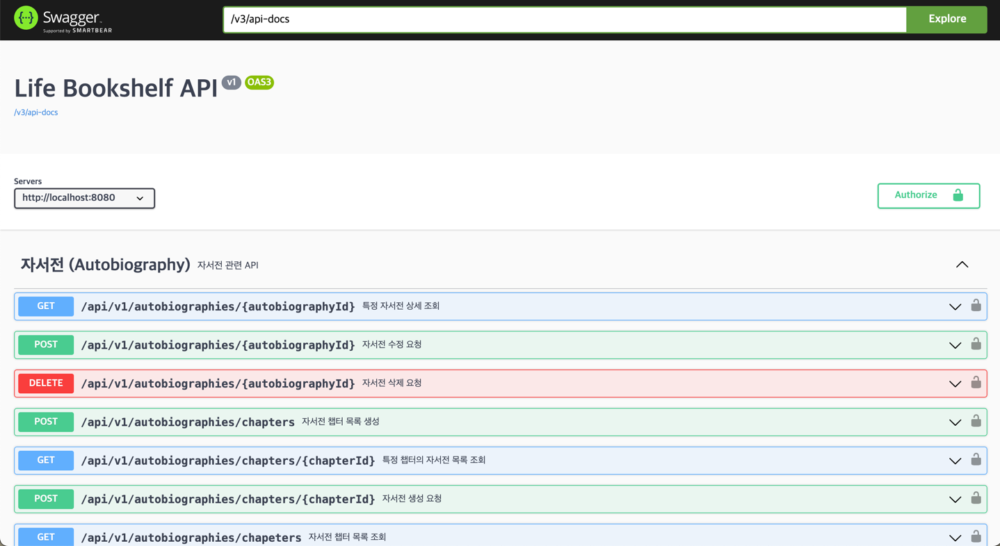
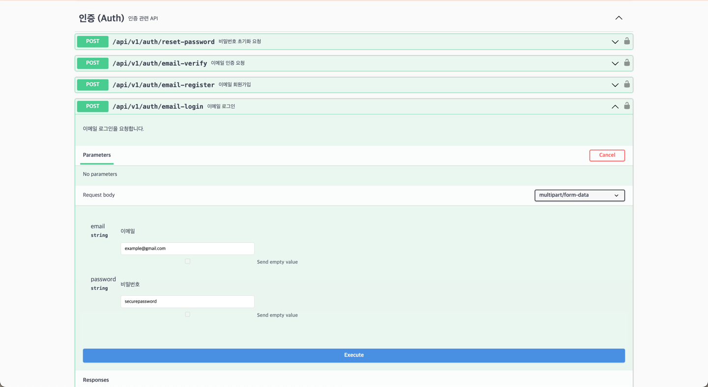
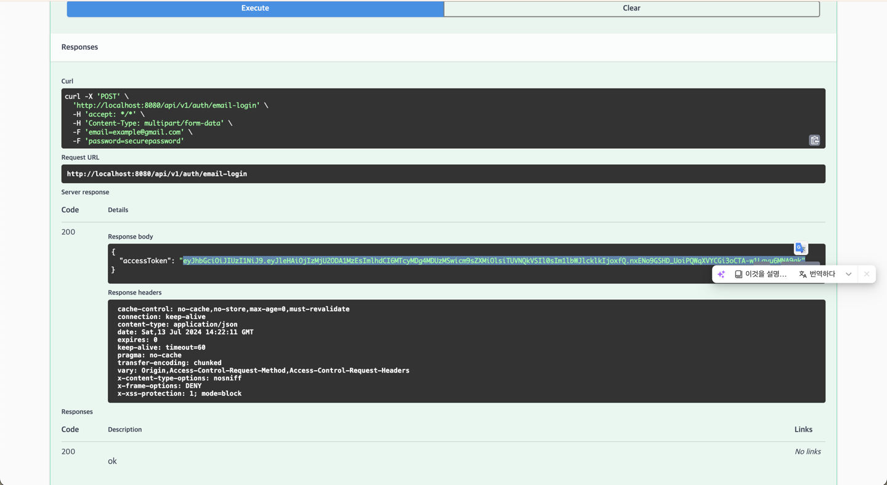
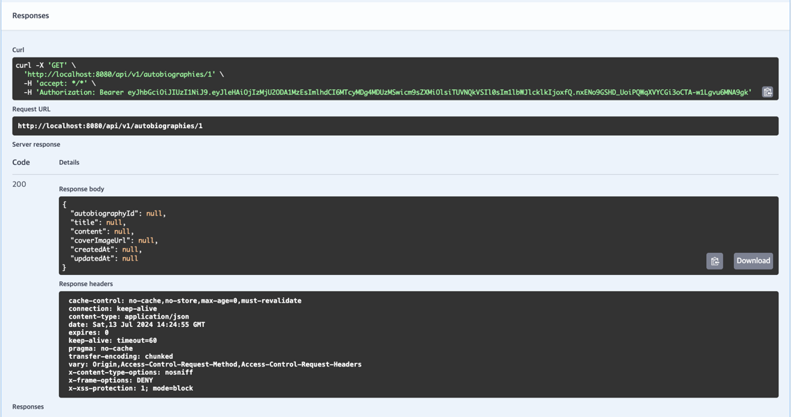

# Life bookshelf Server

**인생책장 서비스의 애플리케이션 서버 레포지토리**

This app was created with Bootify.io - tips on working with the
code [can be found here](https://bootify.io/next-steps/).

## 로컬 개발 환경 설정

### Docker Desktop 설치

OS 환경에 맞는 [Docker Desktop](https://www.docker.com/products/docker-desktop) 설치합니다.

### JDK 설치

[Amazon Corretto 11](https://docs.aws.amazon.com/corretto/latest/corretto-11-ug/downloads-list.html)
를 설치합니다. (JDK 17과도 호환됩니다.)

### Basic Setup

```bash
docker compose up --build -d
```

도커 컨테이너를 실행합니다. `--build` 옵션은 이미지를 빌드하고 `-d` 옵션은 백그라운드에서 실행합니다.

```bash
cp src/main/resources/application-local.yml.example src/main/resources/application-local.yml
```

example 파일을 복사하여 `application-local.yml` 파일을 생성합니다.

### Build

```bash
./gradlew build -x test -Pprofile=local
```

애플리케이션은 다음 명령어를 통해 빌드할 수 있습니다.

### Run

```bash
./gradlew bootRun
```

애플리케이션은 다음 명령어를 통해 실행할 수 있습니다.
기본적으로 local 프로필을 사용하도록 설정되어 있습니다.

## Quick Start

```bash
bash quickstart.sh
```

다음 명령어를 통해 모든 과정을 한 번에 실행할 수 있습니다.

## Swagger 이용 방법


[http://localhost:8080/swagger-ui/index.html](http://localhost:8080/swagger-ui/index.html) 로 접속하여
API 문서를 확인할 수 있습니다.


`POST /api/v1/auth/login` 을 클릭하고 `Try it out` 버튼을
클릭합니다.


`accessToken` 을 복사해둡니다.

> 데모 버전에서는 이메일 인증을 지원하지 않습니다. 회원가입 후, 직접 members 테이블의 role을 `PRE_MEMBER`에서 `MEMBER`로 수정해야 합니다.


`Authorize` 버튼을 클릭하고 `Bearer` 뒤에 복사해둔 `accessToken` 을 붙여넣습니다.


그 후에 인증이 필요한 API를 요청하면, Authorization 헤더에 `Bearer` 뒤에 `accessToken` 값이 자동으로 붙어서 요청됩니다.

## Further readings

* [Gradle user manual](https://docs.gradle.org/)
* [Spring Boot reference](https://docs.spring.io/spring-boot/docs/current/reference/htmlsingle/)
* [Spring Data JPA reference](https://docs.spring.io/spring-data/jpa/reference/jpa.html)
